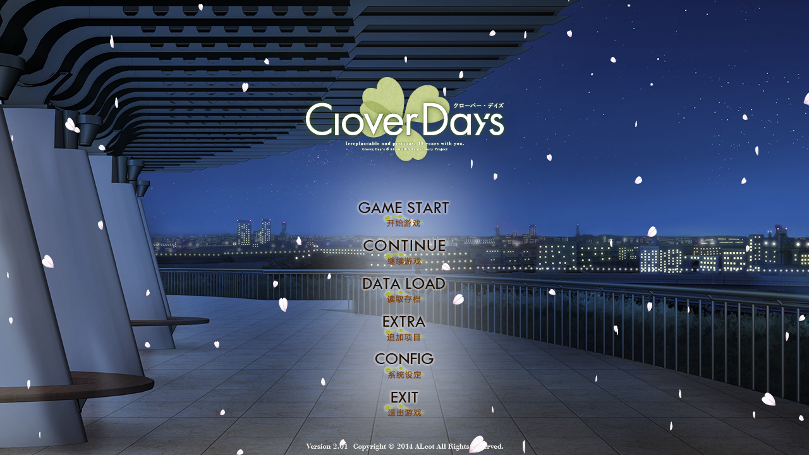

主页面：[MoeImp](http://yoro.xyz/impression/avg)

人设分为声音和作画两部分，按先后顺序标明。

---

ALcot 「Clover Day's」（2014）

本页面以 2016 年发售的 Clover Day's Plus 为基准。

游玩时间： 2020 年 4 月

| Clover Day's | 分数 | 权重 |
| :---------------: |---: |---: |
| 共通 | 10.55 |25%|
| 杏鈴 | 10.85 |15%|
| 杏璃 | 9.95 |15%|
| ヘキル&ヒカル | 10.50 |15%|
| つばめ | 10.80 |15%|
| 泉 | 10.60 |15%|
| 整体评分 | 11.39 N8.88 | |
|Rank| S+ | |

## 共通线

印象分 9.4→8.8/10 趣味 0.2/0.3 情感 0.4/0.5  
人物刻画 0.2/0.5 剧情表现 0.3/0.5  
人物（声音 + 作画）(0.3+0.35)/(0.3+0.4)  
章节总计 10.55/12.5

「止まっていた『想い』が、再び動き始める。」

共通线以回忆与现实的交错为主，主要是交代了人物关系，但是值得一提的是那个将过去的回忆和现在的身影重叠在一起的大冒险的旅途，失散的心重新开始联系的过程深得我心。

值得一提的是选项全部出现在十年前的回忆当中，因此实际上男主十年前就已经攻略了女主（确信）~~你们缺的是幼驯染和妹妹！~~ ~~输在起跑线了（悲）~~

有的时候挺伤怀的，就是那种曾经关系紧密的朋友最后还是落得天各一方的那种沧桑感。

## つばめ

印象分 9.45→8.9/10 趣味 0.15/0.3 情感 0.45/0.5  
人物刻画 0.3/0.5 剧情表现 0.4/0.5  
人物（声音 + 作画）(0.25+0.35)/(0.3+0.4)  
线路总计 10.8/12.5

「今のままじゃ、ダメ、なのかな…」

关西腔好听。

对手戏那一段是真的精彩而震撼，将现实的情感和戏中的角色融合在一起，将情感的爆发表现得十分精彩。

初闻不知曲中意，再听已是曲中人。

其实这个戏台的设定本身就很有一种隐喻的味道，但是最初的时候没有直接让燕来演这个角色也是比较出乎我意料的。然后其他人借用戏中的身份刺激了一下燕，这才让燕明确了心意。（只是为什么在男主并没有完全表露心意的情况下泉还推了一把，~~我暂且蒙在鼓里~~终究是不愿意面对自己的心情吧，也算是和燕形成了一点对比吧）然后同样的戏台不同的人，燕又刺激了泉一把 (bgm38) 又引出了一场精彩的感情戏。这两场戏都非常的……有张力。

这一作是至少对我来说到目前为止刻画人物心理和情感最为精彩，并且将那种青涩的ドキドキ的感觉写到极致的一部作品。

「走得太近，便没有察觉到她也一直有着各种各样的辛酸」

在这一作里面，我经常拿来作为幼驯染评判标准的「距离感」直接失效。就不提十年前好感度就是满的这个设定的情况下来说的话，别的地方是那种「两个人的距离逐渐靠近」，而这作则是「因为距离太近所以一直没注意到」这样的角度。仔细想一想就很容易理解了，确实如果数年以来的印象都不是作为异性看待，想认识到彼此的心意也是一件难事。正如 OP 里面所言：

> 恋の意味も知らなかった  
> 僕たちは少年と少女だった  
> 笑って、泣いて  
> かけがえのない絆を育んだ    

这时候就要掏出一直以来的[靶子](http://yoro.xyz/impression/avg/pxc#空)来举例子（但是 MoeImp/pxc 里面实际上没细提，反倒是 [MoeImp/ftl](http://yoro.xyz/impression/avg/ftl) 里面说的更详细），PxC 的空也是同样的「因为距离太近所以一直没注意到」，但是失败就失败在并没有体现是怎么注意到的这样的过程。

然后告白后就变成一般萌作水平了。本来我还期待着这个「全员幼驯染的十年之约」这个设定发挥更大的作用的，实际上基本也就这样了。

## 杏鈴

印象分 9.45→8.9/10 趣味 0.2/0.3 情感 0.45/0.5  
人物刻画 0.25/0.5 剧情表现 0.4/0.5  
人物（声音 + 作画）(0.3+0.35)/(0.3+0.4)  
线路总计 10.85/12.5

「好き…大好きです…」

在我现在看来，这一作最大的长处就是通过各种方式将角色的心理描绘出来，尤其是像不安和不甘这样的感情，而且这也能和角色的经历和背景联系在一起，构成一份十年之约。哪怕是出现了超展开（指谁是谁的亲生母亲那段），也更加展现了角色的性格和情感的成长，并且深刻展现了家族的羁绊这一主题。正如本作 OP 所言，这是一个有关于双子的「家族」的故事。

某种程度上说，也是在伤痛中成长……吧。从最开始的青涩到最后的决心，主角团经历了巨大的成长。同样的话语在不同的场合向着不同的人流转，化开了不同的烦恼与隔阂。

「思いも言葉も、伝えられるうちに伝えないと、後悔します……」

## 杏璃

印象分 9.2→8.4/10 趣味 0.1/0.3 情感 0.4/0.5  
人物刻画 0.3/0.5 剧情表现 0.1/0.5  
人物（声音 + 作画）(0.3+0.35)/(0.3+0.4)  
线路总计 9.95/12.5

「この背中が、すごく遠かったんです…」

我已经不想再重复说「真实而细腻的情感」这个词组了，那用什么来描述这条线呢？想要靠近却害怕破坏现在的关系，这也是幼驯染/妹系角色常见的情感路数了，但是还是那句话，同样的情感写出来更加真实更加具体，那也是一种功底。

但是塞了几个烦人的配角，闹心。某种程度上这导致了我 Ctrl 了一大段剧情——反正我是对权力斗争这种剧情一点兴趣没有。而且最后矛盾冲突的解决实在是过于……算了。这个剧本与其说是兄妹爱情故事不如说是大人的权力斗争，过于强行了，没意思。

这条线的杏璃的成长确实是显而易见的，从最开始的不坦率的逞强到最后的拿出勇气，角色心态的转变是显而易见的，而且最后的一段台词确实很感人。

> 如果假装通情达理，必须压抑自己的感情才算得上大人的话，我宁愿不成为大人。为了守护重要的东西而去拼搏去挣扎，过上无怨无悔的生活……那才是我想成为的大人！

但是，只可惜促成这一切的事件我实在是看不下去。本来这个妹妹的早期设定非常好，小时候教男主日语也好之后一起学习也好感情发展倒是很自然，但是推动剧情的重要事件居然是欺凌甚至绑架，这我就完全看不下去了。而且如我所说，这些事件很大程度上都是「大人的利益斗争」，什么统治学校也好学校理事会也好，这并不是我关心的事情，而且看着也憋屈。这也导致这条线我没少扣分，感觉白瞎了这么好的一个人设。

嘛，就当我个人喜好问题了。

## 泉

印象分 9.3→8.6/10 趣味 0.2/0.3 情感 0.45/0.5  
人物刻画 0.35/0.5 剧情表现 0.35/0.5  
人物（声音 + 作画）(0.3+0.35)/(0.3+0.4)  
线路总计 10.6/12.5

「でも、あたし、本当は、あの時から…」

听这位骂バカバカ简直是一种享受（。

剧本评价分为前半和后半两部分。

前半：勇气、纠结、恐惧、以及失落（这个指的是燕）。真戏假作我还是头一次见，就这样把自己喜欢的人拱手让人，这看着虐啊。依旧是发挥了本作最为擅长的感情描写，让作为观众的我也代入到了这几个人的心理当中，感受到了几个人的纠结。

后半：超展开谢绝。都说了大人的权力斗争没意思……但是这段剧情比上一条线还是好很多的。（虽然我推最开始那两条线的时候是没有想到到这里会如此沉重）至少首先伏笔安排的非常到位（虽然被我一下子就猜到了），和设定也算是紧密贴合（不像杏璃线感觉就是突然追加的反派），除此之外态度转变也有理有据，看似突然但是实际上有了足够的铺垫：已经接纳了妹妹存在的泉发现了长腿叔叔的真实身份之后当然自然会接受整个家庭，这很自然，至少没那么都合就是了。这里就看出瑞穗的存在的意义了，看似出现的无关的第三人实际上确实关键角色。

但是不同线路的日常部分感觉太接近了或者说太相似了以至于有点审美疲劳想要 Ctrl。

我不得不承认在我 Ctrl 瑞穗相关的日常剧情的时候我是严重低估了这个角色在这条线的作用的，而且在「大人的事情」参与之后我一度也陷入了对杏璃线一样的失望。但是当时我并没有意识到这些其实都是伏笔，为的就是后续剧情的情感爆发。有一说一我其实是低估了这条线 Chapter 3 中前期的剧情作用的。为什么一定要用大量笔墨写瑞穗这个角色以及与主角团怎么打好关系的，是因为在这个人身上有能够展开剧情的重要设定，瑞穗和泉关系越好，后期揭示真相的时候冲击越大。

而后则是泉这个角色的核心剧情矛盾的处理。值得称道的是泉对父亲的怨恨并没有因为男主的一通嘴炮而直接化解，反倒产生了新的裂痕——这要是一般都合主义剧本怕不是男主「你这是逃避」泉「对不起，但是你一说我明白该怎么做了」然后 HE。这个故事没有选择这样草草结束，但是它需要一个结束，于是选择了解铃还须系铃人的方法，也算是合情合理（毕竟不这么干其实也没法收场）

所以还是那句话：搞超展开的前提是前期剧本足够有趣以至于能够让玩家坚持到超展开。幸亏我是 Ctrl 了一段而不是直接退坑，不然就错过了一个还算不错的故事。

## ヘキル&ヒカル

印象分 9.3→8.6/10 趣味 0.15/0.3 情感 0.45/0.5  
人物刻画 0.4/0.5 剧情表现 0.25/0.5  
人物（声音 + 作画）(0.3+0.35)/(0.3+0.4)  
线路总计 10.5/12.5

「ワタシを照らしてくれた、もうひとつの光…」

我认定的真女主线，这回真的是十年之约了。

依旧是分成前半后半两部分。

前半：基本上就是不知道恋爱的意味的少年少女逐渐明白自己心意并且接受对方的感情的过程。虽说是从约定而起的懵懂感情，但是随着互相意识到彼此这份感情的形状发生了变化，也互相愿意接受彼此的变化和感情。哪怕会破坏维持了十年的关系，也不得不为不得不迈出的一步拿出决意。

> 彼此的十年时光，就像我们的唇一样重合在了一起。

然后就一转标准废萌（不是）有一说一这部分甜度还算可以，也算是比较放松而欣喜的一个地方了。

讲真这条线前半根本就是碧瑠个人线，和光瑠没关系啊（）  
而且废萌得不像 Clover Day's（）

后半：「为什么会变成这样呢？」  
无法抑制又不愿抑制的感情，爆发。「三个人结婚」这样的约定到底是童年随口一说还是认真的本意？外表一模一样内心互为镜像的双子的爱的方式，相似而又不同。

这条线是很难去用理性去分析或者思考的这样的一个故事，所以我很难去评价这条线的故事和表达。我觉得以我的理解能力、常识、以及表达能力都不足以去评价这条线。

我倒是能够理解，就是那种无法互相分离的双子同时爱上同一个人也被同一个人爱着，并同时探索三个人同时幸福的「家族」的形态的故事，彼此都是彼此的「光」。但是对我来说这条线是那种看着震撼但是很难产生或者共情或者动情这样的情感触动的。

或许只有能够这样抛开常理和常识的这对双子才能形成这样特殊的关系达成三个人的幸福吧。

当然**现实中这种事情应该是不会发生的。**

题外话：唉，这个呆萌少女碧瑠杀伤力太大了。以及后面有几个画面这双胞胎长相一样发型一样衣服一样声优一样字体颜色都一样，这怎么区分？也难怪男主会认错。

## 整体评价

整体体验 10.54  
系统：全动态立绘与 CG +0.05  
场景动态 +0.05  
人物表情动态 +0.05  
整体「精致感」+0.05  
OP 台本差分 +0.05  
漫画场景（SDCG） +0.05  
音乐 +0.5  
OP1 特别加分 +0.05  
作品总计 11.39/N8.88 S+

我也不知道为什么我对这个系列 OP 抵抗力如此低下。从 OP 就把我基本看哭的游戏这应该是第一个。

对我来说这作是一部惊喜之作，~~将我心目中永远的日常系废萌标杆 [Friend to Lover](http://yoro.xyz/impression/avg/ftl) 给替换掉了（。~~ 真的日常吗？其实并不（。

这个故事以十年前和十年后的变化与约定为核心，讲述了妹妹、妹妹、幼驯染、幼驯染、幼驯染 & 幼驯染的故事~~而且十年前就已经全员好感度拉满了~~，本幼驯染厨妹控狂喜。

四叶草童话（确信）

系统方面，我选择的是 Plus 版，特点是全动态立绘与 CG，确实观感提升了不少，唯一的问题是 i5-10210U 的性能有点吃紧。

题外话：我仔细回想了一下，像这种其他女主推了当线女主一把的剧情在我推过的作品里面似乎并不多见（？）而且萌作里面男主初吻不是给当线女主的也不多见吧（？）~~千恋~~

治愈和胃疼似乎并不矛盾，目前来看说是三角恋也好七角恋也罢总之是这个故事并不是那种所有人都能获得幸福的剧本，优人做出的选择可能或者说势必会打破这个小团体的平衡，或者说势必会造成一定的伤害，而我觉得这作最精彩的地方就是如何去解开十年爱恋的心结这个角度，欣赏~~败犬（不行太缺德了）~~ 其他主角是怎么释怀的。除此之外，或许还会有其他积淀的心结也会一并解决，而如前所述本作最大的亮点就是对情感的细腻描绘和羁绊的表达。

模糊地抓到了一个原作写得很明白但是我一直忽略的一个线索：

这是一个**双子×双子×双子**的关于「**家族**」的故事

没错，家族。我之前一直忽略了这一点的存在因素。从这个角度去看去分析这个游戏中的线路故事，就会发现其实看似唐突的设定背后都是有着明确的主题的，比如说杏铃线恋爱感情和家族羁绊的平衡、以及紫苑的念念不忘和无颜面对，再比如说泉线则是表面上弃妻儿而去实际上一直暗中关照的这样的一个角色，本作一直在强调一个家族羁绊的概念。

顺便吐槽一下，六个女主一个男主结果是五对双子去掉男主也是四对那为啥官方只写仨（。

顺便一提，标题界面每推完一条线公园背景就会变换一个时间段，并且标题背景音乐就会加一个乐器，有什么深意呢？

看着标题界面的漫天樱花，「你找到属于你的幸运四叶草了吗？」

