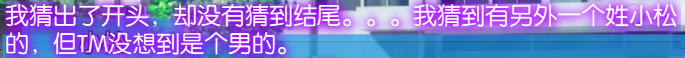
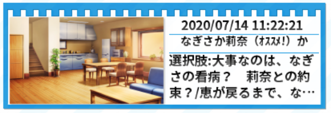
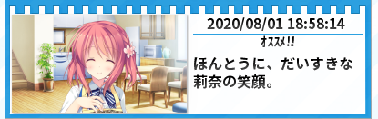

主页面：[MoeImp](http://yoro.xyz/impression/avg)

人设分为声音和作画两部分，按先后顺序标明。

---

ALcot ハニカム 「キミのとなりで恋してる！」（2014）  
ALcot ハニカム 「キミのとなりで恋してる！ ~The Respective Happiness~」（2015）

游玩时间：2020 年 7 月

| キミのとなりで恋してる！ | 概览 |
| :----: | ----: |
| 共通 |9.50|
| なぎさ |10.28|
| 涼香 |9.50|
| 莉奈 |10.40|
| 整体评分 |10.56 N8.25|
| Rank |A|

## 共通线

印象分 9.1→8.2/10 趣味性 0.2/0.3 情感 0.2/0.5  
人物刻画 0.2/0.5 剧情 0.1/0.5  
人物（声音 + 作画）(0.25+0.35)/(0.3+0.4)  
总计 9.5/12.5

又是这种假扮情侣然后无端混沌同居的板子啊……太混沌了……两个嫁候补同居，男主本身还没有任何倾向的情况下就唐突安排修罗场，这我无话可说，比寄宿之恋还要离谱。

顺便一提，这个妹妹不能推，但是出于这个立场倒也不是不能理解就是了。

某种程度上说共通线剧情有点一般，而且给なぎさ点的好感度太高了吧！我是来看莉奈那个知名的告白回来的但是已经要被なぎさ带走了（）不过整体上我觉得还可以，还没说构成缺点，而且还挺自然的。

这几个女主开局满好感的操作，怎么看着这么像 Clover Day's 啊？

然后这个学姐强取男主初吻这个操作，怎么看着这么像 Clover Day's 啊？

这 OP 也一股 Clover Day's 味，不愧是同一会社出品。

我逐渐发现就是幼驯染这个设定很多剧本就容易写成从小好感度就高然后倒贴，倒不是不行……

## 莉奈

印象分 9.3→8.6/10 趣味性 0.3/0.3 情感 0.3/0.5  
人物刻画 0.35/0.5 剧情 0.2/0.5  
人物（声音 + 作画）(0.3+0.35)/(0.3+0.4)  
总计 10.4/12.5

本来共通线的时候我以为剧情向着另外两个女主修罗场这么发展下去的话莉奈还哪来的机会，但是我是有多迟钝才没看出来莉奈的机会正是在于作为让男主最为轻松的存在这个身份，绝了。

这作惯用的一个手法就是偏向叙述性诡计那一侧的。姓小松的不一定是莉奈，但是这样的可能性让秋人意识到了自己的感情，这样的设计意外地也调动了作为玩家的我的情绪。真的写出了就是那种明明一直在身边为什么一直没有意识到呢这样的感觉。

顺便一提，直接引用 VNR 里面的我也不知道是谁的评论：

然后这个告白……「俺と付き合わない？」「別にいいけど？」**萌绘击沉**。对于这两个人来说，没有气氛就是最好的气氛，既不会让人感到胃痛，也不会过于紧张，也不需要什么装饰，这就是最自然的状态。虽然我早就已经知道了这样的发展，但是在真正面对这一场景的时候还是感受到心的融化了。

引用一下 [Bangumi 用户 凤源](http://bgm.tv/user/407356)的[评论](http://bgm.tv/blog/289269)（含有轻微剧透）：

> 当你放学回家路上，跟着那个与你从小一起长大的女孩子购物归来，走在回家的路上，正是夕阳西下，早已被她吸引的你望着她的侧脸，心中涌动着酸甜的情愫和一丝占有欲，你不禁向她表白了，甚至连"喜欢"二字都不需要说，而早已跟你心意相通的她，就像回答“明天还要一起上学吗”一样理所当然又平淡地答应了你的表白，又拿出刚刚买的糖果问你要吃哪个，一切就像往常自然。终于你将她送到了家门口，这时你才有了你们已经在交往着的实感，不等你反应过来，她向你道别，冷不丁地在你的脸颊上留下了存有她刚刚吃过的柠檬糖味道的一枚亲吻。无论在你们的哪一方看来，你们的表白，交往都是这么自然，仿佛早就注定似的。

然后再看个人线内的话也是这种非常自然不做作的感觉，与其说是刚开始交往不如说是十几年的老夫老妻了（？）有趣的同时也不失甜度，也不会有那种因为两个人都过于紧张看着着急的感觉，非常的舒服。（就是莉奈每次接吻都会失神稍微有点鬼畜）

也正如标题所说，爱的人也许就在身边。是这样的。

## 涼香

印象分 9.1→8.2/10 趣味性 0.0/0.3 情感 0.3/0.5  
人物刻画 0.2/0.5 剧情 0.2/0.5  
剧情深度：友情 & 亲情 +0.05  
人物（声音 + 作画）(0.2+0.35)/(0.3+0.4)  
总计 9.5/12.5

从路线分歧到男主意识到自己的感情这一段稍微有点没太看懂，但是大概还是理解了。总之这是一个双方都是始于一见钟情的故事，但是在这之中可没少虐なぎさ，甚至连带着虐了点莉奈，这……

至于这个角色，就很性格分明：率直大胆、坦率不绕弯子、超高的行动力、占有欲。是一个只要见到就会非常印象深刻的角色，而且这个形象一直都很突出，也起到了重要的剧情推进作用。但是进了个人线之后的反差之大……怎么说，都说反差萌反差萌，但是真的到了反差如此之大如此之快的时候反倒觉得不对劲。明明是如此具有进攻性的一个人，有着非常明确的事业目标，结果交往之后刚开始那段时间感觉全都是在 kiss 都没怎么训练，感觉之前的所有铺垫连同なぎさ的努力一起全部木大，很怪（虽然这个问题后续算是解决了）。

但是在这作我感觉到个人线也连贯的碎片化了起来。就，很多情节都是点到为止，然后靠后续进行补充。比如告白那段，一个跑开一个追，然后这一节到这就结束了，之后向妹妹报告的时候才交代的当时发生了什么，就感觉有点突然，也不连贯，很神秘，就有一种跳跃感。问题主要是出在章节衔接上（？）太跳跃了！

另外一点，我能感觉到这作试图在恋爱故事之外添加一些其他的内容的感觉，即使是个人线也不会只着眼于两个人的恋爱关系，不如说这条线なぎさ的戏份也不少。怎么讲，很大程度上可以说在这样的环境和背景下如何维持幼驯染三个人的羁绊以及なぎさ无法得到回应的爱恋也是一个看点（问题是这会导致轻度的胃痛，有点难受）。

另外，虽然我一般几乎不涉及 HS 相关内容的讨论，但是这个男主在这条线的不行程度和瓜生新吾差不多了——问题是瓜生新吾哪条线都不行，你这其他线不是好好的嘛。

总之这条线我推下来的感觉是略微有些微妙的，也没什么太大意思。

但是说了这么多，我不得不承认这作在描写恋爱感情之外的东西这方面做的不错。幼驯染三人关系的维系、凉香家两代人互相理解的真正原因，在这些东西上写的还算不错，尤其是凉香打电话那段差点骗到了我的眼泪（。

值得注意的是，这条线（和莉奈线）的 ED 是没有人声的，而 staff 表分明写着歌：茶太。可以想见在设计的时候应该存在不同女主重要性不同的设计？但是我应该是不会改评分权重的。

## なぎさ

印象分 9.2→8.4/10 趣味性 0.2/0.3 情感 0.3/0.5  
人物刻画 0.3/0.5 剧情 0.35/0.5  
人物（声音 + 作画）(0.28+0.35)/(0.3+0.4)  
剧情深度：友情 & 亲情 +0.1  
总计 10.28/12.5

明显这条线就奔着真女主路线去了。

这个なぎさ声音太小了，就算音量最大有时候也无济于事。

有的时候就在想，甜过头了就会腻（？）本作这几条线都是，在某些地方上实在是过于超现实以至于「恋爱实感」会比较差。

然后这条线的剧本就是一盘大棋：试图在一条线（算上 Side Story）之内交代并尝试解决男主的女主的基友的还有妹妹的心结，把伏笔交代清楚，这个工作量还是蛮大的，而且明显就是没有剧情锁的 TE 的感觉。

然后说说剧情。虽然说似乎「全世界都在支持着同一个人」这样的剧本见惯了，但是依旧是蛮感人的，拾起了自己曾经放弃过的东西所需要的决心便是如此。所以为什么说 [絆きらめく恋いろは](./mekuiro) 在这方面处理得不好，因为拾起了自己曾经放弃过的东西这方面根本就没写。

故事本身还是不错的，「不要让自己后悔」这个意思也传达到了，整体上还是可以的。尤其是——

我对这种过去和现在重合这种剧本毫无抵抗力。

然后说说这作偏叙诡的东西，剧透警告：

通过故意不吐露事实让你以为妹妹被标枪穿了（莉奈线）/ 奶奶咯血病发命不久矣（本线），然后发现只是撞到头了 / 番茄酱吃多了，就，惊心动魄。看一次觉得很感动（哥哥抱住妹妹 CG.jpg），但是多了就感觉套路了。

ED 给我来了一大段日语听力。算是给每个人都交代了一个不错的结局，而且最后的镜头切换……哭了。

说起来这个游戏每个存档都有对应的章节标题，而更有趣的是每个选项也都有对应的存档标题，给你提示让你放心进行选择。当然 Clover Day's 也有存档标题，但是没有像这作这种神奇的提示。  
但是值得一提的是这个「オススメ！」，最初推的时候怎么看怎么都像官方夹带私货啊？

推完这条线明白了，莉奈标推荐的理由其实是因为なぎさ线算是真女主 TE 的意味了所以放到后面推的体验会大幅度上升，绝对不亏。

## Profile & Side Story

（计入系统分）  
Profile 里的路人介绍 +0.01  
Profile 主角介绍 & Side Story +0.2

需要特别提到的是 Side Story。本来我是想单独拿出来给个权重的但是果然还是算了。通过 Side Story 的其他人的视角去发现这个故事的不同方面，是一件非常有趣的事情。

这一作通过 Side Story 和人物介绍，在主线故事之外也提供了许多值得探索和发现的故事、伏笔和要素，对于这样的作品来说内容变多了当然是好事，增添了些探索感，也补充了一些故事情节和人物的刻画。有些剧情只是补充发糖（虽然也，微妙！）有些则是对故事背景的扩充，很重要所以不要错过。（而且我觉得很多东西写得比本篇内容要好）

然后这作连女子生徒 A 和学园长，不如说出现过的每个人都有名字和设定的，有点意思。

题外话：犹豫了很久 Side Story 到底应该按照线路标准评分还是直接算进系统里，最后决定还是就这样吧，主要原因是 Side Story 内容实在是丰富，而且也难以按照线路标准评分。

Side Story 有一部分就是单纯的福利日常，但是真正值得一提的妹妹和基友那几本剧情，是给这一作的一个重要升华。在这样的背景下，包括基友对女人感到厌烦的原因也好，妹妹不能推的原因也好，都完全交代清楚了，而且每一个都是足够感人的小故事。

在此基础上，再去看 Profile 里面有关于妹妹、基友和奶奶的介绍——不如说，有关于这几个人的结局，就感觉，这些人真的是被这个世界温柔对待着啊。

每个人都提供了一个美好的结局。

## 整体评价

各线路平均 9.92  
系统：SDCG +0.05  
场景过场对话 +0.02  
人物表情动态 +0.05  
存档小标题 +0.01  
Profile & Side Story +0.21  
音乐 +0.3  
总计 10.56/N8.25 A

推荐攻略顺序：总之なぎさ放在最后，然后记得去看完每一个 Side Story 和每一个主角的 Profile。

logo 不好看。过场的语音听不懂不过能听懂的部分还都挺有意思的。

剩下想说的都前面说完了，就这样。

## FD 「~The Respective Happiness~」

先说好，FD 不打分。因此我也可以以一种相对轻松的心态去看待和评价。

这个 FD 的一大特征就是加入了根据玩家选择修改发型的系统，但是意义不大，也没有说像 [Friend to Lover](./ftl) 那种带剧情的……就那么回事吧。

以下按照我个人攻略顺序，也是我推荐的攻略顺序。

### 凉香 After

怎么说呢……加入了新的不可攻略角色，那自然是有目的的。一方面是试图加强「亲情的羁绊」这个主题，另一方面也是为了体现凉香被男主改变的样子（比如说「我自己的身体我自己清楚」和「那我就听你的吧」之间的对比，再比如说やきもち的增强）

然后男主的「不行」都已经成梗了吧？

依旧是更换标题界面的套路……不过依旧是奏效。

### Side Story - 彩香 01

果然这作的精髓在 Side Story 啊……交代彩香和凉香的过去，更能凸显出上面提到的改变的可贵，总而言之是一个只有爱着这个世界的编剧才能写出来的故事。

### 莉奈 After

果然还是幼驯染纯度非常高，萌绘大满足！

而且这个妹妹也是！

然后故事本身就是一个从原来的距离感形成新的更加亲近的距离感的过程。能在なぎさ面前秀恩爱了，以及男主终于学会了向莉奈提起自己的诉求了，这样亲近之上更加亲近的距离我称之为幼驯染之神 #2. （顺便一提 #1 是并不是严格幼驯染的望月理奈）

这条线的结构也是精妙，最开始莉奈提出了「试用期」之后提出了自己的要求，总之是让男主多多表达自己的诉求而不是只考虑莉奈（说起来男主就这性格，也是），然后在整条线平淡日常过后，当我们都忘了开头试用期这茬的时候，发现男主依旧是没有提出自己的诉求，莉奈决定回去的时候男主发现

1. 自己根本舍不得分开
2. 自己不说出来是没办法争取到幸福的

这回可不能让你跑了，然后可喜可贺，可喜可贺。

我最后也总算是明白了为什么在「オススメ！」之上还要再「オススメ！！」了。逻辑自洽，甜度适中，波澜不惊。

### Side Story - 胜彦 01

知道基友家庭背景的人都知道，基友和凉香这两家都有一定的过去心结和矛盾。但是通过这样的一个故事点明基友心结的同时丰富了人物，期待一个改变的契机和转机。

### なぎさ

还算不错，但是不知道说啥，除了结尾没啥感觉。

### Side Story - 胜彦 02

基友终于拥有了自己的幸福，可喜可贺，可喜可贺。顺便一提基友女朋友也可爱（）

然后莉奈的出场……我永远喜欢小松莉奈！

「那不是逞强。莉奈那家伙也找到了自己的幸福。」

真好啊真好啊——

### Side Story - 彩香 02

其实感觉更多的就是给妹妹的 Side 做个铺垫的感觉？

### Side Story - 惠

第一个 Side 是虐妹时间。妹妹从本篇 Side 结尾开始对秋人女友的嫉妒最终总算是转化成了「希望能够带给别人幸福」这样的愿望，其实是很大的成长了吧？不过殊不知实际上妹妹的笑容已经带给很多人幸福了……（包括我？）然后经过多年的成长，应该是终于能够得到释怀的感觉了。

唉，这个妹妹真好啊！

目前在我推过的所有作品中排名第一的妹妹，是个不可攻略角色。

### 总结

本篇之上更上一层楼，非常优秀。如本作标题所说的，每一个角色都拥有了属于自己的对应的幸福。

我以前是不给 FD 打分的，这次破个例跳过打分阶段，直接给个 Rank S。
