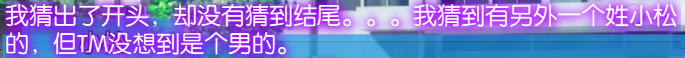
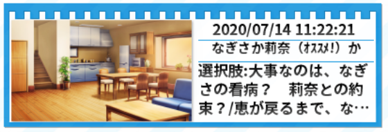

主页面：[MoeImp](http://yoro.xyz/impression)

人设分为声音和作画两部分，按先后顺序标明。

---

ALcot ハニカム 「キミのとなりで恋してる！」（2014）

游玩时间：2020 年 7 月

| キミのとなりで恋してる！ | 概览 |
| :----: | ----: |
| 共通 |9.50|
| なぎさ |-|
| 涼香 |-|
| 莉奈 |10.40|
| 整体评分 |- N-|
| Rank |-|

## 共通线

印象分 9.1→8.2/10 趣味性 0.2/0.3 情感 0.2/0.5  
人物刻画 0.2/0.5 剧情 0.1/0.5  
人物（声音 + 作画）(0.25+0.35)/(0.3+0.4)  
总计 9.5/12.5

又是这种假扮情侣然后无端混沌同居的板子啊……太混沌了……两个嫁候补同居，男主本身还没有任何倾向的情况下就唐突安排修罗场，这我无话可说，比寄宿之恋还要离谱。

顺便一提，这个妹妹不能推，但是出于这个立场倒也不是不能理解就是了。

某种程度上说共通线剧情有点一般，而且给なぎさ点的好感度太高了吧！我是来看莉奈那个知名的告白回来的但是已经要被なぎさ带走了（）不过整体上我觉得还可以，还没说构成缺点，而且还挺自然的。

这几个女主开局满好感的操作，怎么看着这么像 Clover Day's 啊？

然后这个学姐强取男主初吻这个操作，怎么看着这么像 Clover Day's 啊？

这 OP 也一股 Clover Day's 味，不愧是同一会社出品。

我逐渐发现就是幼驯染这个设定很多剧本就容易写成从小好感度就高然后倒贴，倒不是不行……

## 莉奈

印象分 9.3→8.6/10 趣味性 0.3/0.3 情感 0.3/0.5  
人物刻画 0.35/0.5 剧情 0.2/0.5  
人物（声音 + 作画）(0.3+0.35)/(0.3+0.4)  
总计 10.40/12.5

本来共通线的时候我以为剧情向着另外两个女主修罗场这么发展下去的话莉奈还哪来的机会，但是我是有多迟钝才没看出来莉奈的机会正是在于作为让男主最为轻松的存在这个身份，绝了。

这作惯用的一个手法就是偏向叙述性诡计那一侧的。姓小松的不一定是莉奈，但是这样的可能性让秋人意识到了自己的感情，这样的设计意外地也调动了作为玩家的我的情绪。真的写出了就是那种明明一直在身边为什么一直没有意识到呢这样的感觉。

顺便一提，直接引用 VNR 里面的我也不知道是谁的评论：

然后这个告白……「俺と付き合わない？」「別にいいけど？」**萌绘击沉**。对于这两个人来说，没有气氛就是最好的气氛，既不会让人感到胃痛，也不会过于紧张，也不需要什么装饰，这就是最自然的状态。虽然我早就已经知道了这样的发展，但是在真正面对这一场景的时候还是感受到心的融化了。

引用一下 [Bangumi 用户 凤源](http://bgm.tv/user/407356)的[评论](http://bgm.tv/blog/289269)（含有轻微剧透）：

> 当你放学回家路上，跟着那个与你从小一起长大的女孩子购物归来，走在回家的路上，正是夕阳西下，早已被她吸引的你望着她的侧脸，心中涌动着酸甜的情愫和一丝占有欲，你不禁向她表白了，甚至连"喜欢"二字都不需要说，而早已跟你心意相通的她，就像回答“明天还要一起上学吗”一样理所当然又平淡地答应了你的表白，又拿出刚刚买的糖果问你要吃哪个，一切就像往常自然。终于你将她送到了家门口，这时你才有了你们已经在交往着的实感，不等你反应过来，她向你道别，冷不丁地在你的脸颊上留下了存有她刚刚吃过的柠檬糖味道的一枚亲吻。无论在你们的哪一方看来，你们的表白，交往都是这么自然，仿佛早就注定似的。

然后再看个人线内的话也是这种非常自然不做作的感觉，与其说是刚开始交往不如说是十几年的老夫老妻了（？）有趣的同时也不是甜度，也不会有那种因为两个人都过于紧张看着着急的感觉

也正如标题所说，爱的人也许就在身边。是这样的。

## 整体评价

各线路平均 -  
系统：SDCG +0.05  
场景过场 +0.02  
人物表情动态 +0.05  
存档小标题 +0.01  
Profile 里的路人介绍 +0.01  
Side Story +0.1  
音乐 +0.3  
总计 -/N- 待定

logo 不好看。妹妹不能推。过场的语音听不懂不过能听懂的部分还都挺有意思的。

说起来这个游戏每个存档都有对应的章节标题，而更有趣的是每个选项也都有对应的存档标题，给你提示让你放心进行选择。当然 Clover Day's 也有存档标题，但是没有像这作这种神奇的提示。  
但是这个「オススメ！」怎么看怎么都像官方夹带私货啊？

然后这作连女子生徒 A 和学园长，不如说出现过的每个人都有名字和设定的，有点意思。

需要特别提到的是 Side Story。本来我是想单独拿出来给个权重的但是果然还是算了。通过 Side Story 的其他人的视角去发现这个故事的不同方面，是一件非常有趣的事情。

这一作通过 Side Story 和人物介绍，在主线故事之外也提供了许多值得探索和发现的故事、伏笔和要素，对于这样的作品来说内容变多了当然是好事，增添了些探索感。
